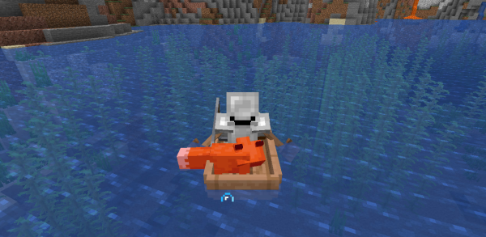

**UPDATE: This bug has been fixed in 1.16.2 (20w29a), so this mod is no longer required.**

# BoatFix

In 1.16 there's a bug that causes small mobs (e.g. cats and foxes) to take drowning damage while riding a boat ([MC-189788](https://bugs.mojang.com/browse/MC-189788)). 

This mod fixes that. That's all it does.
